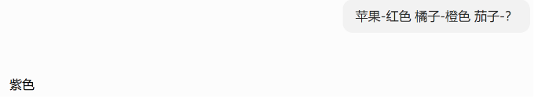

关注 AI 领域的同学们应该对这几个词并不陌生，近两年这三个词轮番出现，在技术圈闹得沸沸扬扬。

而今天让我们来看看，这三个词究竟都是什么。

## 模型的输入

在正式开始前，我们不得不说到这样一个问题：模型的输入是什么？

其实大模型就像一个函数，输入一个 X，得到一个 Y，不过这个函数不是幂等性的，X 相同时，模型返回的 Y 不一定相同，这是因为模型内部是跟据概率分布的方式产出下一个 Token 的。

> 也就是说，模型的输入就是那个 X（对应的是 Context Window），也就是提示词。无论是工具调用还是历史消息，又或者 RAG 检索，都是会拼接成一个长长的提示词给到模型。

## Prompt Engineering

这样我们就可以来开始说第一个，Prompt Engineering 了。

这个阶段的核心思想是通过优化输入指令的表达，在单轮推理中约束模型输出，解决**怎么说模型才能听懂、做对**的问题。

因为当时人们发现，对于不同的提示词构建方法，产出的结果质量是不同的，所以人们在当时对于提示词的构建提出了许多的方法。

### Few-shot（少样本学习）

我们可以在提示词中给出一些例子（样本），模型会跟据你给出的例子回复答案。

一看便知：



### RTC 构词法

RTC 是指三个词语：**R**ole、**T**ask、**C**ontext。

我们在构建提示词的时候可以使用这个构词法来让我们的提示词更加清晰有结构。

一般的模板是：

> 你是一个 \[角色]
>
> 现在的背景是 \[上下文]，
>
> 请你完成如下任务：\[任务描述]。

### CoT（Chain of Thought，思维链）

当时大模型应用还停留在单次推导单次输出的时代，所以需要我们手动利用提示词的方式告诉大模型，让他们一步一步来分布推理。

我们可以通过在提示词后面加上"我们一步步思考"，实现 CoT。

这种方式没有任何样本，所以也可以称作**零样本思维链策略（zero-shot-CoT strategy）**。

### 迭代优化提示词

Prompt Engineering 是针对提示词的工程，所以提示词优化就显得特别重要，迭代优化提示词更是重中之重。

我们有两个方式优化提示词：**人工迭代**和**智能迭代**。

- **人工迭代**：顾名思义，就是通过人观察不同提示词的对应产出结果优劣来对其进行修改。
- **智能迭代**：是通过将模型分为不同角色，让其对提示词进行评价、给出修改意见、进行修改的方式进行迭代，整条流程都依靠大模型。

Prompt Engineering 部分还有很多，例如格式化输出、重复指令保证大模型以其为重点等，这里不再赘述。

## Context Engineering

到了这个阶段，人们不再满足于进行单次提示词的构建，开始转向于构建、组装提供给大模型的最优上下文（context）。

看到这里，我们可能会存在疑惑：这和 Prompt Engineering 有什么区别？

其实 Prompt Engineering 可以看作是 Context Engineering 的子集，主要聚焦于提供给大模型完整的"语言环境"，还会涉及到**什么时候**将信息注入到提示词中。

举个例子，我们发送给大模型一句话："你今天为什么要给我打电话？"

这句话看上去很短，但是在我们的逻辑中，我们需要同时知道今天的时间、什么时候打的电话、内容是什么。

这些信息就是 Context Engineering 的关键。

### RAG

在 Context Engineering 阶段，其中一个影响力最大的概念就是 RAG（Retrieval-Augmented Generation），翻译过来就是**检索增强生成**。

一看这个东西其实很多时候我们会一头雾水，但是其实很简单，就是将我们的某些东西，存到一个数据库里面，等需要的时候，从数据里面取出，拼接进入上下文。

这个如果展开说篇幅会非常长，可以看我的对应博客。这里不多赘述。

### 上下文管理

Context Engineering 中将提示词分为了许多部分进行管理，一般来说有 **System Prompt**、**User Question**、**Memory / History**、**Tool / Output Schema**、**RAG / Tools Results**。

- **System Prompt**：这里存放角色设定、行为边界等约束条件。
- **User Question**：是用户本轮会话的输入。
- **Memory / History**：是过去多轮会话的信息，分为**短期记忆**和**长期记忆**。短期记忆一般是本 Session 中的一个滑动窗口，会进行压缩、总结、摘要等操作后注入上下文；长期记忆需要通过 RAG 按需检索后注入上下文。
- **Tool / Output Schema**：这里是 Tools 定义和模型调用 Tools 的格式要求和返回的格式要求。
- **RAG / Tools Results**：文件读取、检索结果、工具调用结果会放在这里。

而上下文并不是越多越好——上下文越多，噪声很大，会导致模型无法找到真正重要信息；而上下文少了，信息不足，回答会出现**幻觉**。

同时，当上下文变长时，会出现 **Lost in the Middle** 的情况，模型会对开头和结尾的信息更敏感，放在中间的信息有时会被忽略。

还记得之前提到的 Context Window 吗？研究表明，随着上下文变长，模型的整体准度会逐渐下降；当输入 + 输出的 token 数占满 Context Window 较大比例时，下降会变得尤其明显（具体阈值因模型和任务而异，并不是一刀切的某个百分比）。

## Harness Engineering

Agent = LLM + Harness

这是什么意思？Harness 翻译过来是**缰绳**，Harness Engineering 的核心就是构建整套可以驾驭 LLM 的体系。

### 任务编排

这里是将 Agent 的完整执行流程拆分成为子任务的策略，防止 Agent 出现目标偏移等问题。

#### 有限状态机执行

例如 LangGraph 这种，预先定义节点，连接成图，模型仅可在预定义好的规则内移动。

#### Plan-and-Execute

任务入口先由规划器一次性产出完整计划，随后按计划逐步执行，最后再进行校验；若未通过，则触发重规划。

#### ReAct

通过 **Thought → Action → Observation** 循环来解决问题：先思考规划，随后行动，最后观察是否达到完成条件；若未完成则再次进入循环。

这种好处就是灵活——每一步由模型跟据目前状态进行规划。

#### Multi-Agent

多 Agent 方法，将复杂任务拆分成为多个环节，每个环节由对应 Agent 负责。

这里分为许多形式的架构：

- **层级式架构**：由主控 Agent 作为老板，其他 Agent 作为员工。老板进行任务拆解、分配任务、把控进度；员工用于执行任务，员工之间不直接通信，消息都流转至主控。
- **流水线式架构**：多个平级 Agent 按流程进行接力作业。虽然可预测性强、效果稳定，但是灵活性差。
- **对等协作式架构**：所有 Agent 共享一个全局状态和目标，从不同角度给出答案，Agent 之间可以直接对话、相互提问。
- **对抗式架构**：需要有至少两个立场对立的 Agent，通过"生成—批判—修正"的循环进行博弈，这样可以显著降低幻觉和错误，防止一边倒的情况。

### MCP

之前我们提到，Agent 需要调用工具（Tools）。但很快大家就发现一个尴尬的问题——每个 Agent 框架都要自己对接一堆工具，每个工具又要适配一堆框架，这是一个典型的 **N × M** 问题。

为了解决这个，Anthropic 在 2024 年提出了 **MCP（Model Context Protocol）**。

简单来说，MCP 定义了一套统一的接口规范：工具 / 数据源只要按照这个规范插上，任何兼容 MCP 的 Agent 都可以直接调用，就像 USB-C 把各种外设的接口标准化了一样。

它把工具和使用工具的 Agent 解耦了，所以社区一下子冒出了一大批 MCP Server——读文件、查数据库、跑命令……一个协议全搞定。

MCP 解决的是工具怎么接进来的问题，而 Harness Engineering 真正难的，是**怎么让 LLM 在一套复杂流程里稳定地完成一件事**。这两件事经常被混在一起，但其实 MCP 只是 Harness 的一小部分。

### 工具调用

光把工具插进来还不够——还得让 LLM **知道怎么调**。

这就是 **Tool Use**（也叫 **Function Calling**）要做的事：模型不再只是输出一段文字，而是按事先约定好的 JSON Schema，输出我要调用哪个工具、参数是什么。Harness 拿到这个结构化输出后，真正去执行工具（查数据库、调 API、读文件），再把结果塞回上下文，让模型继续推理。

举个最直观的例子：让模型算 `12345 × 67890`，纯靠它自己大概率算错；但只要给它一个 `calculator` 工具，它就能输出：

```json
{ "tool": "calculator", "args": { "expr": "12345 * 67890" } }
```

Harness 拿到后真去算，把结果喂回去，模型再告诉你答案。

工具调用看起来简单，但实际工程里有一堆细节：

- **Schema 设计**：工具的描述必须清晰、参数必须有约束，否则模型容易选错工具、填错参数。
- **调用策略**：是一次性把一堆工具全摊给模型挑，还是只暴露当前任务相关的几个？前者灵活，后者稳定。
- **错误处理**：工具调用失败（超时、报错、参数非法）怎么办？重试？降级到别的工具？还是让模型自己改？
- **安全边界**：不是所有工具都能无脑让模型调，删除文件、转账这种敏感操作必须有额外的审批或拦截。

所以 MCP 解决了工具怎么接进来，**Tool Use 解决的是工具怎么被 LLM 安全、可靠地用起来**——两者搭配，Agent 才算有了真正的手脚。

### 记忆系统

我们之前在 Context Engineering 部分提过短期 / 长期记忆，但只是一笔带过。其实 **Memory 是 Harness 里非常核心的一块**——它决定了 Agent 到底是一次性的大模型调用，还是真正能跨会话工作的角色。

常见的记忆分层大致是这样的：

- **工作记忆（Working Memory）**：当前正在处理的任务上下文，比如多步任务的中间结果。
- **短期记忆（Short-term Memory）**：本 Session 内多轮对话的历史。一般用一个滑动窗口装着，超出窗口就压缩成摘要。
- **长期记忆（Long-term Memory）**：跨 Session 的事实、偏好、用户画像。需要持久化（比如写到向量库或 KV 库里），用到的时候再按需检索回来。

举个例子：你跟 ChatGPT 说我喜欢用 Go 写后端，下次开新窗口它也能记住——这就是长期记忆在工作。

工程上要做好记忆，麻烦的地方主要有三块：

- **写入时机**：什么时候把新信息写进记忆？每轮都写太吵，只在结束时写又容易丢；通常的做法是让模型自己判断这条值不值得记。比较稳的解法是**异步提取**——每轮对话结束时，跑一个小模型把潜在记忆抽出来，简单去重和打分后再入库；这样既不阻塞主流程，也不容易漏掉关键信息。
- **压缩策略**：记忆不能无限膨胀，否则检索召回会越来越慢、噪声也越来越大。所以摘要、剪枝、按重要性排序这些活少不了；常见的做法是用模型把长对话压成短摘要，或者直接抽取关键事实（比如用户偏好、关键结论）以结构化形式存储——这些套路在后面的成本控制一节还会再展开。
- **检索质量**：长期记忆的命中准不准，直接决定 Agent 表现得聪不聪明。最基础的方案是用 Embedding 做语义检索，命中语义相近的记忆；想再准一点可以做混合检索——Embedding + 关键词一起召回，最后再过一层 Re-rank，让更强的小模型把结果重排一遍。

现在的产品里，ChatGPT 的 Memory、Claude 的 Project Memory、Cursor 的项目级 Rules 都在做类似的事。可以说，**记忆做得好不好，比模型本身更能决定 Agent 的人格**。

### Skill

如果说 MCP 解决的是工具接入，那 **Skill** 解决的就是经验复用。

一个 Skill 通俗点说就是把做某件事的经验打包成一个可复用的模块：里面可能包含特定的提示词、调用工具的步骤、若干规则约束，甚至还有对应的子工作流。

比如你想让 Agent写一篇符合本博客风格的博客，你就可以把它打包成一个 Skill，里面塞好排版偏好、目录结构、引用规范等等。以后只要一句话触发这个 Skill，模型就会按这套既定流程干活。

Skill 的好处是显而易见的：

- **可复用**：一套经验多场景使用，不用每次重新描述。
- **可维护**：经验升级时，只改 Skill 这一份就行。
- **可组合**：多个 Skill 可以按需组合，形成更复杂的能力。

现在主流的 Agent 产品基本都内置了类似的机制，比如 Claude Code 的 Skills、Cursor 的 Rules / Custom Instructions 等。一个好的 Skill 库，往往比模型本身更能决定产品的上限。

### 成本控制

最后，必须聊一聊成本。

LLM 调用是按 token 计费的——上下文越长，账单越厚；推理轮次越多，钱包越瘪。一个没做成本控制的 Harness，跑起来可能比雇个实习生还贵。

成本控制的手段大致有这么几类：

- **上下文压缩**：这是最直接的一招。Harness 在每次推理前，会对历史消息做摘要、剪枝、抽取关键事实，把上下文压到刚好够用。这块策略其实和上面记忆系统的压缩是同一套思路，只是应用场景不同。
- **Prompt Cache**：如果你的 System Prompt 或工具描述是固定的，可以让模型服务方把这段前缀缓存起来，重复利用，省 token 也省时延。
- **Semantic Cache**：把语义相同的问题归类，命中缓存就直接返回历史答案，连模型都不用调。
- **模型路由**：简单任务用小模型（快且便宜），复杂任务再升级到大模型（贵但准）。Harness 决定什么时候用哪个。
- **批处理 / 并行**：能并行的工具调用并行起来，能批的请求批起来，省的是时延也是钱。

这其中，**上下文压缩**是用户感知最强的一块，也是最值得展开讲的。我们前面讲过 Lost in the Middle 和上下文越多噪声越大，压缩策略正好是这些问题的解药——但怎么压、压多狠、哪些必须保留、哪些可以丢掉，没有标准答案，全靠业务场景调。

常见的压缩手法有这么几种：

- **截断式**：只保留最近 N 轮对话，简单粗暴，适合闲聊类场景。
- **摘要式**：把历史消息让模型压缩成一段摘要再塞回去，保留语义但损失细节。
- **抽取式**：用模型从历史里抽出关键事实（比如用户偏好、关键结论），以结构化形式存储。
- **分层式**：把上下文分成必须保留和按需召回两层，需要时再检索回来。

不同手法各有取舍，最终往往是组合着来的。

## 小结

到这里，三个"Engineering"我们就讲完了。

如果用一句话概括它们的关系：

> **Prompt Engineering 是基础，决定了单次对话的天花板；Context Engineering 是当下，决定了能不能把信息组织好；Harness Engineering 是未来，决定了能不能驾驭 LLM 去做真正复杂的事。**

三者不是替代关系，而是**层层递进、互相嵌套**——Prompt 是 Context 的最小单元，Context 是 Harness 的一次输入，而 Harness 则把前两者的能力真正放到了工程实践中。
