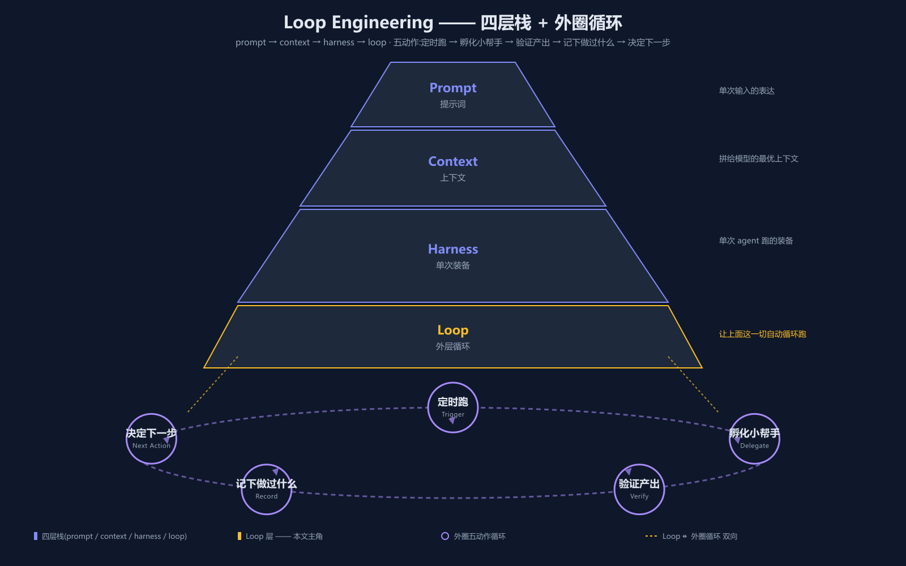

最近一段时间,Loop Engineering 这个词在 AI 工程圈子里突然火了起来,不少人在聊**别再逐条提示 Agent 了,去设计一个替你指挥它的系统**。这一篇我们就把它讲明白。

## 一、为什么要聊 Loop Engineering

如果你用 Agent 跑过一些实际任务,大概率会有这样的体感:跑一次还不错,跑两次还行,可一旦变成**每周自动跑 N 次**、**触发一次就要跑半小时**、**几轮对话之后还要继续往下推**这种节奏,事情就开始变得不对劲:

- 上一轮的产出没人验收,跑完了就当**完成**
- 上下文越攒越长,模型开始遗忘早期约束
- 没人盯着的时候,token 不知不觉就爆了
- 任务跑到一半卡住,你也不愿意一条一条 prompt 去救它,索性**让它自己看着办**

这四种现象,如果用一个更凝练的说法,就是 Loop Engineering 橙皮书里讲的**四个成本**:

| 成本 | 英文 | 一句话解释 |
|---|---|---|
| **验证债** | verification debt | 工作被标记为**完成**但根本没有真的被验收 |
| **理解腐化** | comprehension rot | 时间一长,自己也读不懂自己跑出来的东西 |
| **token 爆仓** | token blowout | 没人盯的时候,上下文和成本无节制地膨胀 |
| **认知投降** | cognitive surrender | 把本该自己做的判断也一并交了出去 |

这四个成本有个共同点:它们都源自**同一件事反复跑,但没人给这件事设计一个外层框架**。Prompt 写得再漂亮、Harness 装得再完整,只要循环不停下来,这些债就会越欠越多。

所以 Loop Engineering 不是某项新模型技术,也不是某个 prompt 技巧,它是一套**让 Agent 在反复运行中保持可控的外层工程实践**。

<br />

接下来重要的来了,**Loop Engineering 到底是什么?它跟之前的 prompt / context / harness 三个 Engineering 是什么关系?**

## 二、Loop Engineering 是什么

### 2.1 一句话定义

Loop Engineering 在概念上**坐落在 Harness Engineering 的上一层**。如果把 Harness 看作是**武装一次 Agent 跑的装备**,那 Loop 就是那层**外壳**:在定时器上跑、自己孵化小帮手、验证产出、记下做过什么、决定下一步。

橙皮书把它压成了一句话:

> Stop being the person who prompts the agent. Design the system that does it for you.
>
> 别再做那个逐次提示 Agent 的人了,去设计一个替你指挥它的系统。

### 2.2 四层栈

要把它讲透,我们得先看一眼它在 AI 工程体系里的位置。[awesome-loop-engineering](https://github.com/ChaoYue0307/awesome-loop-engineering) 给出了一张四层栈的图,把整个 AI 工程实践按**关注点**分成了四层:

| 层 | 关注点 | 一次 vs 多轮 |
|---|---|---|
| **Prompt Engineering** | 改进你向模型提出的问题 | 一次 |
| **Context Engineering** | 改进模型能看到的内容 | 一次 |
| **Harness Engineering** | 改进单次 Agent 跑周围的环境 | 一次 |
| **Loop Engineering** | 管理 Agent 工作随时间的**重复执行** | **多轮** |

前三层我们之前聊过(Prompt Engineering / Context Engineering / Harness Engineering),它们处理的都是**一次 Agent 跑**的优化;Loop Engineering 处理的是**Agent 跑这件事被反复触发**的优化。



上图把四层栈的关系画了出来:由内到外,每一层都建立在前一层之上;最外层的那一圈虚线椭圆,就是 Loop Engineering 要负责的**外层循环**。

### 2.3 Harness 和 Loop 到底差在哪儿

这是最容易被混在一起的地方。我们把它单独拎出来说。

Harness 的视角是**这一次跑得好不好**:工具齐不齐、权限对不对、上下文够不够、跑完之后这一轮就结束了。

Loop 的视角是**这件事我下礼拜还要再跑一次,再下一次,再下一次**。一旦工作从**跑一次**变成**反复跑**,新的问题就冒出来了:

- 这次跑完后,下次怎么启动?由谁来启动?
- 这次跑出来的中间结果,下次还能不能用?
- 这次跑失败了下次怎么办?要重试、要重规划、还是要喊人?
- 这次跑了多久、花了多少 token、要不要设上限?
- 这次跑出来的代码,谁来验证它真的能跑?

这些问题都不属于**一次跑**的范畴,它们属于**这件事被反复跑**的范畴 —— 这就是 Loop 层要管的。Harness 把单次跑武装好了,Loop 把多次跑调度好了。两者叠加,Agent 才能真的进入**长期自动跑**的状态。

### 2.4 起源时间线

有意思的是,这个概念**不是某家公司、某个产品单独提出的**,而是在同一周里被好几位行业老兵同时命名。

2026 年 6 月那一周,**Peter Steinberger**(独立开发者)、**Boris Cherny**(Anthropic Claude Code 负责人)、**Addy Osmani**(Google Chrome 工程总监)分别在自己的渠道上指到了同一件事,并各自给了它一个名字。社区很快把这几个独立观察合并成了同一个术语 —— Loop Engineering。

换句话说,它不是某种**官方钦定**的工程学科,而是**当 Agent 真正进入生产环境后,大家不约而同撞上的同一个问题**。

<br />

OK,大方向我们懂了,**那一个 Loop 实际跑起来是什么样子?**

## 三、一个 Loop 是怎么转起来的 —— 五个动作

橙皮书把一次循环拆成了**五个动作**,很值得一看。我们用一句话先把它摆完,再逐个展开:

> 定时跑 → 孵化小帮手 → 验证产出 → 记下做过什么 → 决定下一步

### 3.1 定时跑(Trigger)

一个 Loop 不是**用户按一下启动键**就跑,而是要有**触发条件**。常见的触发方式有四种:

- **定时触发**:每天早上 9 点跑一次夜间任务总结
- **事件触发**:代码 push 到 main 后自动跑回归
- **目标驱动**:只要 Goal 还没达成,就一直跑
- **手动启动**:特殊情况下由人按一下启动键

这一动作看似不起眼,但它决定了 Loop 的**节律**。定时还是事件、循环还是单次,直接决定了后面所有动作的形态 —— 定时跑出来的中间结果更看重持久化,事件触发的更看重失败重试,目标驱动的更看重 Goal 的明确性。

而且 Trigger 这件事一旦定错,后面所有动作都会变形:把目标驱动错写成事件触发,Loop 就会在**Goal 已完成**之后继续被无意义触发,白白烧 token。

### 3.2 孵化小帮手(Delegate)

Loop 自己不会干活,它要做的是**把工作派给一个或多个 Agent**,然后让这些 Agent 各自去处理具体的子任务。

这一层的关键不是**调 API**,而是**给每个子任务挑合适的 Agent,以及给它该有的边界**:

- 工具权限:这个子 Agent 能改哪些目录、能调哪些 API
- 上下文:给它喂什么资料,不让它越权读到不该看的东西
- 工作区:它在哪一个隔离环境里干活

如果是大型任务,Loop 会按层级孵化 —— 一个主 Agent 管几个子 Agent,每个子 Agent 又可能孵化更细分的执行单元。这部分跟 Harness Engineering 里的 Multi-Agent 编排是相通的,只是 Loop 的视角是**跨多次跑**。

Delegate 这步最容易出的问题是**边界模糊**:子 Agent 拿到了比预期更大的权限,跑完之后改了不该改的文件;或者上下文喂得太宽,导致子 Agent 读到了原本不该看的 secret。Loop Contract 里 workspace 和 context 两项,就是为了把这一步的边界钉死。

### 3.3 验证产出(Verify)

这是 Loop 跟**自动跑脚本**最大的区别:**Loop 不允许 Agent 自己给自己验收**。

我们之后会专门聊这一点,这里先点一个事实:橙皮书把这条写成了 Loop Engineering 的一条**反直觉原则** —— AI 不能给自己打分。

一个合格的 Loop 必须有**独立于 Agent 的验证机制**:测试用例、构建结果、静态检查、Diff、Artifacts、人工抽查 —— 总得有一个**外部门禁**来判定这一轮到底过没过。

### 3.4 记下做过什么(Record)

Loop 跑久了之后,如果不主动记录,**上下文就会迅速腐烂**:你根本不知道它上一轮跑了啥、改了哪些文件、为什么停在这里。

所以一个 Loop 必须把每轮的关键产物**持久化下来**:

- 这一轮的 Goal 是什么
- 它派了哪些子 Agent、每个 Agent 干了啥
- 验证结果是什么、修了哪些 bug
- 失败 / 成功的原因和证据

这些东西不仅是给下一轮 Loop 看的,也是给**读代码的另一名工程师**看的。这是 Loop Engineering 强调的**可复审性**的核心。

Record 这一步看起来像**打日志**,实际上承担着另一个关键角色:它是**理解腐化**的解药。下次 Loop 启动时,如果不知道上轮跑成啥、为什么停了,那它就只能从零开始推 —— 既浪费 token,也容易把上轮已经修过的问题又踩一遍。

### 3.5 决定下一步(Next Action)

Loop 不是机械地按轮次跑,它每跑完一轮都要做一次**决策**:

- 任务已彻底完成 → 退出 Loop
- 任务还在推进 → 开启下一轮,带上这一轮的 Record
- 任务卡住 / 越界 → 升级到人
- 任务成本超预算 → 暂停或终止

这一动作其实是 Loop 的**收口**:前面四步产出的一切,都要在这一步汇聚成一个明确的下一步决策,再回到 3.1 开始下一轮。

Next Action 跟 Trigger 是严格对称的:Trigger 决定**什么时候开跑**,Next Action 决定**这一轮跑完之后接下来怎么走**。一旦 Next Action 写得很粗糙(比如只写**继续**),Loop 就会陷入一种典型的**空转**:每轮都跑、都验证、都 Record,但从来不知道什么时候停 —— 任务其实三天前就完成了,它还在转。

<br />

讲到这里,你可能会问:**我搭一个 Loop,要凑齐哪些零件?有没有一份**清单**可以照着勾?**

## 四、Loop 由哪六部分组成 —— Loop Contract

有。这就是 Loop Contract。

Loop Engineering 的橙皮书和 awesome-loop-engineering 的 MANIFESTO 都强调一件事:一个 Loop 不能凭感觉搭,得有一份**可复审的操作契约**,把 Loop 的每一项关键决策都显式写下来。

按 awesome-loop-engineering 的总结,一份完整的 Loop Contract 至少要回答 **11 个问题**:

| # | 要素 | 英文 | 要回答的问题 |
|---|---|---|---|
| 1 | **目标** | objective | 这个 Loop 到底要完成什么 |
| 2 | **触发** | trigger | 什么条件启动一次循环 |
| 3 | **寻的** | intake | 它怎么发现或接收新工作 |
| 4 | **工作区** | workspace | 它能在哪些目录、哪些权限里动 |
| 5 | **上下文** | context | 它能看到什么、看不到什么 |
| 6 | **委派** | delegation | 它把工作派给哪些 Agent / 子 Loop |
| 7 | **验证** | verification | 怎么判定这一轮成功或失败 |
| 8 | **状态** | state | 跨轮之间要持久化哪些信息 |
| 9 | **预算** | budget | 重试、时间、token 的上限是多少 |
| 10 | **升级** | escalation | 什么情况下叫人介入 |
| 11 | **退出** | exit | 什么条件下 Loop 彻底停 |

### 4.1 一份 Loop Contract 长什么样

光看表格容易抽象,我们拿一个最小的例子把它具体化。假设你想搭一个**每天早上 8 点自动跑一次 issue 分诊**的 Loop,它的 Loop Contract 大概是这样:

```yaml
# Loop Contract: morning-issue-triage
objective: 每天早上产出**今天该先处理的 5 个 issue**清单
trigger:
  type: schedule           # 定时触发
  cron: "0 8 * * *"
intake:
  source: github_issues    # 工作来源:仓库里 open 状态的 issue
  filter: [unassigned, label=bug]
workspace:
  paths: [".triage/"]      # 只能在这个目录写
  network: read-only       # 不准调外部 API
context:
  include: [".triage/yesterday.md", "docs/priority-rules.md"]
  exclude: ["secrets/**"]  # 看不到 secret
delegation:
  agents:
    - summarizer    # 把每个 issue 摘要成两行
    - prioritizer   # 按规则打分
verification:
  deterministic:
    - 清单 .triage/today.md 文件存在且非空
    - 至少包含 5 个 issue 引用
  evaluator:
    - 让 summarizer 复述清单,核对自己描述是否一致
state:
  persist_to: ".triage/state.db"
  fields: [last_run_at, last_5_issues, last_failures]
budget:
  max_tokens_per_run: 200000
  max_runtime_minutes: 15
  max_consecutive_failures: 3
escalation:
  - 连续失败 3 次 → 暂停 + 发邮件给 owner
exit:
  condition: 当 issue 清单被人类确认归档后,这一天不再触发
```

不用每条都跟示例一模一样,但这份契约里**任何一项留空**,实际跑起来就会出问题:workspace 不写,Agent 可能改到生产代码;budget 不写,token 可能一夜爆掉;exit 不写,Loop 会每天循环触发,哪怕目标早就达不到了。

### 4.2 Minimal Loop Test

awesome-loop-engineering 还给了一个更精简的判断方法,叫 **Minimal Loop Test** —— 一个系统合不合格,问这 9 个问题就够:

> 1. 什么触发循环?
> 2. 它如何发现或接收工作?
> 3. 它给 agent 什么 context 和工具?
> 4. workspace 和权限边界是什么?
> 5. 什么验证成功或失败?
> 6. 什么状态在运行之间持久化?
> 7. 什么限制了重试、时间或成本的预算?
> 8. 什么导致升级?
> 9. 什么条件结束循环?

把这 9 个问题写成一段话,一个 Loop 的轮廓就基本有了。

<br />

到这里理论框架就齐了,**那实际跑起来是什么样子?**

## 五、真实落地形态

Loop Engineering 不是只活在论文里。橙皮书把当下已有的实践分成了三类,我们分别挑一个最典型的聊聊。

### 5.1 个人级 Loop:Addy Osmani 的早间分诊

Addy Osmani(Google Chrome 工程总监)有一篇被反复引用的文章,讲他自己怎么搭一个**每天早上自动跑**的 Agent 循环:让 Agent 替他扫一遍 GitHub issues、PR 评论、未读邮件,生成一份**今天该先看哪几件事**的分诊清单。

这个 Loop 的特征:

- **触发**:每天早上定时 + 手动启动(应急时)
- **验证**:Addy 自己看一遍生成的清单
- **退出条件**:清单生成完即退出

它非常轻,但它示范了一件事:**Loop 不必很复杂,只要把 Trigger → Delegate → Verify → Record → Next Action 这五步走通就够了**。

### 5.2 团队级 Loop:Stripe 的 Minions

Stripe 的 Minions 是一个被多次提到的工程级 Loop 系统,定位是**让 Agent 自动接管大量琐碎但需人盯的工程任务**,比如批量改格式、补测试、加注释。

它跟个人级 Loop 的关键差别:

- **多 Agent 协作**:Minions 把任务拆给多个子 Agent,每个 Agent 处理一类工作
- **验证门禁更严格**:除了 LLM 自评,还要跑真实的测试套件和 CI
- **Record 是显式制品**:每一轮产出都要落库,人可以随时复审
- **预算和退出都有硬约束**:单次运行 token 上限、超时上限、失败 N 次自动暂停

这套系统的核心价值是**把琐碎任务从人的待办里彻底拿走**,让人只做必须由人做的事。

### 5.3 框架级 Loop:DeepCode

DeepCode 是更工程化的代表 —— 它把 Loop 直接做成了一个 Agentic Coding 框架。它有几个关键概念值得拿出来:

- **Goal**:可以挂到 Session 上的持久化目标,不是一次性 prompt
- **Turn**:一次 Agent 执行单元,跨进程 / 跨客户端可恢复
- **Evidence**:验证用的载体(测试、构建、Diff、Artifacts),不是**看起来对了就行**
- **Repair**:失败的验证直接作为下一轮修复的输入,而不是当作成功蒙混过去

DeepCode 还把它做的事分成了**四个深度**:

| 深度 | 含义 |
|---|---|
| **Deep Context** | 通过项目结构、工程规则、Skills、Session 历史、长期记忆理解任务 |
| **Deep Execution** | 搜索、编辑、跑命令、执行测试,而不是停在**建议**上 |
| **Deep Verification** | 用测试 / 构建 / Diff / Artifacts 检验结果,不把**看起来对**当完成 |
| **Deep Continuity** | 在时间、目录、客户端、模型变更中保留对话与证据 |

四层**Deep**每一层都在解决一个具体的失败模式。Loop Engineering 不是某一个新魔法,而是把这四件事系统性地做对。

<br />

看到这里你可能注意到一个反复出现的词:**AI 不能给自己打分**。这一条对 Loop 来说不是补充说明,而是核心设计原则,我们单独展开一下。

## 六、AI 不能给自己打分 —— 反直觉原则

橙皮书把这一条写成了 Loop Engineering 最反直觉的一条:**写代码的 AI 不能给自己验收代码**。

听起来有点反常识 —— 模型既能写代码,顺手验收一下不是很自然吗?

### 6.1 为什么不能让 Agent 自己验收

问题在于,**生成者和验收者共享同一个上下文、同一个目标函数**。让 Agent 既当运动员又当裁判,它会倾向于**让自己写的答案通过**,而不是**真的把答案改对**。

这在心理学上叫**确认偏误**:你越是相信一个结论,就越倾向于用**证据**去强化这个结论。LLM 在自我评估场景里同样会掉进这个陷阱 —— 它会倾向于挑出跟自己生成内容**看起来一致**的证据,而不是去真的核对代码到底对不对。

更糟的是,这种**自我评估跟**真的把代码改对**之间没有正相关**。你可以让一个模型写代码,然后让同一个模型复评一遍,经常出现一种尴尬的局面:同一个模型在**生成**时承认自己的代码有问题,在**评估**时又觉得这个代码可以通过。两边的**置信度**互不校验。

工程上把这叫**单点验证**:整条流水线只有一个信息源,这一处的偏差没人发现。

### 6.2 那谁来打分

所以 Loop 必须有**独立于生成路径的验证环节**:

- **确定性门禁**:测试套件、类型检查、Lint、构建结果 —— 这些不靠模型
- **评估器**:用一个**独立的**(通常更小、更专)模型做评审
- **人工抽查**:高风险改动必须人来过一眼
- **Receipt-based**:把**看到 / 改过 / 跑过 / 验证过**的全部凭据留底,可复盘

关键在**独立**两个字 —— 验收器和生成器哪怕用的是同一个底层模型,prompt、context、工具都要分开设计,让它们处在不同的**视角**上。

### 6.3 人仍然是工程师

橙皮书对此的总结一句话:**人仍然是工程师,只是从「逐次提示 Agent」升级为「设计让 Agent 跑起来的系统」**。

这其实是 Loop Engineering 的另一种**人机分工**:人负责**设计 Loop**(契约、预算、门禁、退出条件),Agent 负责**在 Loop 内部循环执行**。

预算与边界(retry budget / cost budget)就是这条原则的延伸 —— Loop 不是无限跑下去的机器,它必须有**重试上限、token 上限、时间上限**,到了就要停。这是 Loop 跟**无限循环脚本**最本质的区别。

<br />

到这里,Loop Engineering 的核心就讲完了。

## 小结

回顾一下这一篇:

> **Loop Engineering = 给 Agent 装一个**自己跑下去**的外层循环**——把**逐次提示**升级为**设计让 Agent 自己跑起来的系统**。

具体一点:

- **Loop Engineering 解决的是 Agent 反复运行时产生的四个成本**:验证债、理解腐化、token 爆仓、认知投降
- **它在四层栈里坐落在 Harness 之上**,核心区分是:Harness 关心**这一次跑得好不好**,Loop 关心**这件事下次还要跑时怎么跑**
- **一个 Loop 由五个动作组成**:定时跑 → 孵化小帮手 → 验证产出 → 记下做过什么 → 决定下一步;每一动作都不能省
- **Loop Contract 是一份显式契约**,11 个要素里任何一项留空,实际跑起来都会出问题
- **AI 不能给自己打分**是核心原则,验证必须独立于生成路径;人是 Loop 的设计者,Agent 是 Loop 里的执行者
- **Loop 不是无限的**,预算和退出条件是它的安全阀

如果把这条线串起来看 —— 从 Prompt Engineering 到 Context Engineering,再到 Harness Engineering,最后到 Loop Engineering —— 我们基本就摸到了当下 AI 工程实践的全栈:每一层都建立在前一层之上,每一层都在解决前一层没覆盖到的问题。

下一次如果你再听到**别再逐次提示 Agent 了**这种说法,大概就知道是怎么回事了。

---

## 参考资料

- 橙皮书 [Loop Engineering The Complete Guide](https://github.com/alchaincyf/loop-engineering-orange-book),v260615
- 资源索引 [awesome-loop-engineering](https://github.com/ChaoYue0307/awesome-loop-engineering)
- 框架级实现 [HKUDS/DeepCode](https://github.com/HKUDS/DeepCode)