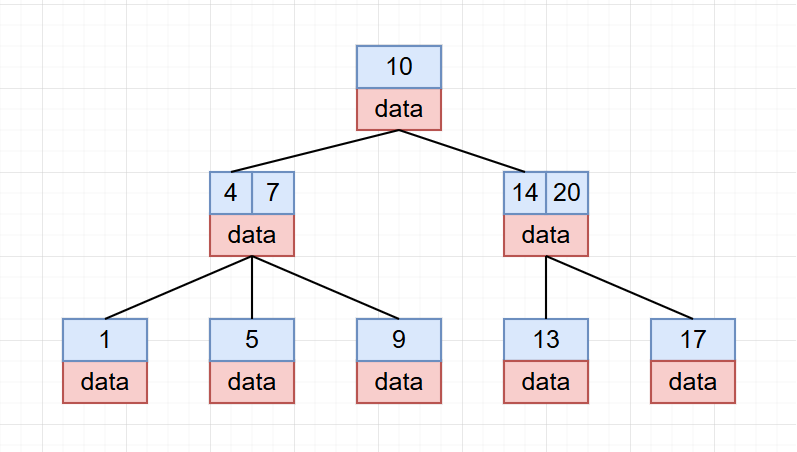
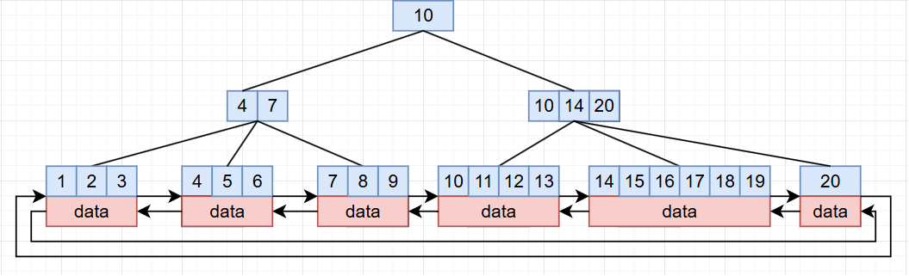

提到索引，我们想到的会是数据库的目录。可是，你有没有想过，为什么它可以像目录一样让数据库快速地定位到我们要查找的目标行？

## B 树与 B+ 树

在讲解这两种索引之前，让我们先简单了解一下这两种数据结构。

首先是 B 树，它是一种多路平衡查找树，我们可以把它想象成一颗多路径的平衡二叉树：



这张图就是 B 树的示意图，从中我们可以看到一些细节：

- 每个节点会携带一个或多个 key，用于分割 n 个子树
- 每个节点都携带对应 key 的数据
- 所有叶子节点高度统一

而 B+ 树和 B 树稍微有些不同：



从图中我们看到，B+ 树的非叶子节点不存数据，数据仅在叶子节点存储；叶子节点之间用双向链表连接。

聚簇索引和非聚簇索引的存储方式都基于 B+ 树。MySQL 选择 B+ 树而不是 B 树，其中一个重要原因正是 B+ 树的叶子节点通过双向链表相连，这让范围查询和顺序扫描都可以沿着链表高效完成。

## 聚簇索引和非聚簇索引

看完 B 树和 B+ 树之后，我们再来看聚簇索引和非聚簇索引。

聚簇索引和非聚簇索引其实不是一种"索引类型"，它和唯一索引、普通索引不是一个层级的概念，更应该说是一种**数据存储方式**。

聚簇索引的叶子节点中保存着完整的一行数据；非聚簇索引的叶子节点不存完整的数据行，存的是索引键和用于回表定位数据的"指针"——在 InnoDB 中，这个指针就是对应记录的主键。

在 MySQL 的 InnoDB 引擎中同时支持聚簇索引和非聚簇索引两种存储方式，而在 MyISAM 引擎里仅支持非聚簇索引。在 InnoDB 里主键索引就会使用聚簇索引，而其他索引会使用非聚簇索引。MyISAM 引擎不支持聚簇索引，所以所有索引的存储方式都是非聚簇（叶子节点存的是指向数据文件的行偏移）。

## 回表查询

对于聚簇索引存储方式，查询数据的方式就是从根节点直接走到叶子节点，找到对应数据行，直接返回。

而非聚簇索引呢？它的叶子节点并不存完整的数据行，那要怎么拿到数据？

在非聚簇索引中，我们也是从根节点向下走到叶子节点，得到对应的主键 ID，接着拿着这个主键 ID 回到聚簇索引中再走一遍，取出对应的完整数据行——这个"多走一遍"的过程，就叫**回表查询**。

所以，在 InnoDB 中直接使用主键进行查询的效率会更高，因为不需要经过回表查询。

## 覆盖索引

覆盖索引是一种常用的查询优化方式，主要用处就是用来避免回表查询。

它的原理是：当我们查询需要的字段，恰好都能在正在使用的非聚簇索引里拿到时，就不用再回表，可以直接在索引树上返回结果。

举个具体的例子。假设我们给 `user` 表的 `name` 列建了一个普通索引，由于 InnoDB 的非聚簇索引叶子节点本身就包含主键，那么像下面这条查询：

```sql
SELECT id, name FROM user WHERE name = 'xxx';
```

它需要的 `name` 和 `id` 两个字段都能从 `(name)` 这棵二级索引树上拿到，不用回到聚簇索引去取数据行，这就算一次"覆盖索引"查询。

需要注意的是，覆盖索引并不是一种新的索引类型，而是一种**使用方式**——只要你写的查询能被某个已有索引完全"覆盖"，它就生效。实际开发中，把"查询里常用到的列"和"WHERE 条件列"一起建成联合索引，是制造覆盖索引最常见的做法。

## 小结

- B 树每个节点都存数据；B+ 树只有叶子节点存数据，且叶子节点用双向链表相连，这让范围查询更高效。
- 聚簇索引本质上是一种数据存储方式：叶子节点保存完整的数据行；非聚簇索引的叶子节点只存索引键和定位数据的指针，InnoDB 里这个指针就是主键。
- InnoDB 的主键索引使用聚簇索引，其他索引使用非聚簇索引；MyISAM 不支持聚簇索引。
- 回表查询指的是：先在非聚簇索引上找到主键，再回到聚簇索引中取完整数据行，本质上是多走了一遍 B+ 树。
- 覆盖索引让我们能够仅通过非聚簇索引就拿到所有需要的字段，避免回表；它本身不是新索引，而是一种索引的使用方式，常见的做法是把查询列和条件列一起建成联合索引。