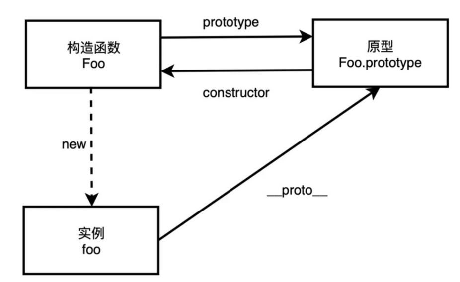
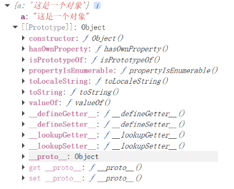
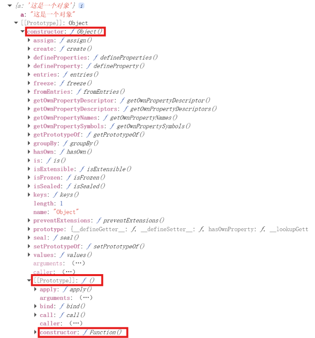
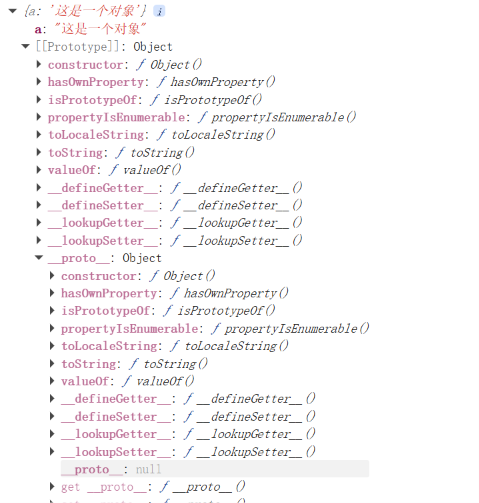
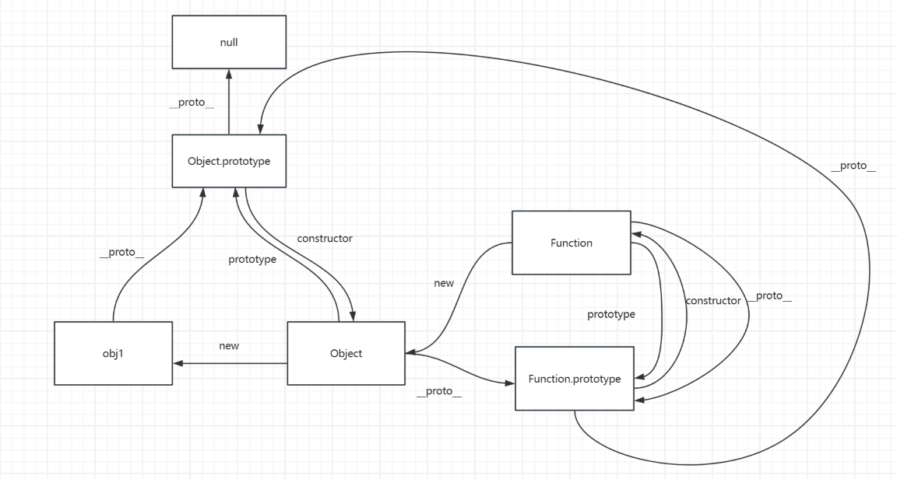

JS 是一门**基于原型的面向对象**语言。

有些同学可能有点疑惑，什么是基于原型？它和 Java 这种基于类的语言有什么不同？别急，看完这篇就懂了。

## 一、构造函数与实例对象

在 ES6 之前，我们要创建一个"类"，得写一个函数，再用 `new` 关键字去调用它：

```js
function Person(name) {
  this.name = name
}

const p = new Person('Alice')
```

这里的 `Person` 被称为**构造函数**，而 `p` 就是通过 `new` 出来的**实例对象**。

2015 年发布的 ES6 新增了 `class` 关键字，看起来像 Java 那种正经的类了：

```js
class Person {
  constructor(name) {
    this.name = name
  }
}
```

但事实上 `class` **只是一个语法糖**，实际上跑的依然是原型那一套。换句话说，JS 的类其实是"仿造"出来的，底层和 Java 那种真正的类并不一样。

## 二、原型对象与 `__proto__`

搞清楚构造函数和实例之后，下一个问题：实例身上没写的方法，比如 `valueOf`，为什么直接就能用？

答案藏在实例对象内部一个叫 **`[[Prototype]]`** 的隐藏槽里。

**`[[Prototype]]`** **是 ECMAScript 标准规定的**：每一个 JS 对象都自带这样一个内部存储槽，规范里用双层方括号 `[[Prototype]]` 标记，代表它是引擎私有的、代码无法直接读写的底层属性。

那我们想看看 `[[Prototype]]` 里到底有啥，怎么办？浏览器提供了 `__proto__` 这个属性作为查看入口。官方并不推荐直接操作 `__proto__`，毕竟它主要是为调试设计的，乱改容易让原型链陷入混乱。

回到开头那个问题：实例对象上没写的方法从哪来？正是从原型对象上"继承"下来的。

**什么是原型对象？** `new` 的过程中，引擎会偷偷给实例的 `__proto__` 赋一个值，让它指向另一个对象——对实例而言，那个对象就是它的**原型对象**。原型对象本身也是个普通实例，所以它也有自己的 `__proto__`，于是就形成了一条链式结构：**原型链**。

调用 `对象.xxx` 一个属性时，引擎会先在实例自己身上找，找不到就顺着 `__proto__` 去原型对象上找；原型对象上也没有，就继续往上……直到尽头。这样就能解释为什么 `valueOf`、`toString` 这些"公共方法"我们从没自己写过，却到处都能用。

## 三、三角关系

理解了基本概念，我们来看看构造函数、实例对象、原型对象三者之间的引用关系。



如上图，三个实体通过指针互相索引：

- **实例对象** 通过 `__proto__` 指向**原型对象**
- **原型对象** 通过 `constructor` 指回**构造函数**
- **构造函数** 通过 `prototype` 指向**原型对象**

来看一个最直观的例子：

```js
const obj1 = { a: '这是一个对象' }
console.log(obj1)
```



在控制台里能看到 `[[Prototype]]`，展开后里面有 `constructor` 属性，指向 `Object`——也就是这个字面量对象的构造函数；除了 `constructor`，还能看到 `valueOf`、`toString`、`hasOwnProperty` 等一大堆方法。它们都不是我们写的，而是 `Object` 的原型对象自带的，调用时顺着原型链就找到了。

这里还有个反直觉的点：**构造函数本身也是一个实例对象**。我们说 `Person` 是构造函数，但它的构造函数其实是 `Function`：



这说明 `Person.__proto__ === Function.prototype`。所有函数本质上都是 `Function` 构造出来的实例。

## 四、原型链的顶端

每个原型对象也是一个实例，理论上原型链可以无限延伸下去。但事实并非如此——原型链是有尽头的。

展开 `Object.prototype`，继续看它的 `__proto__`，会发现是 `null`：



也就是说，**原型链的顶端是** **`null`**。当属性查找走到 `null` 时，引擎就知道"没了"，返回 `undefined`，不会再继续往上找了。

下图是一个较为完整的原型链全貌图：



这里有一个有意思的细节：**`Function.__proto__ === Function.prototype`**。这是 JS 设计上的一个自指环——所有函数（包括 `Function` 自己）的 `[[Prototype]]` 都指向 `Function.prototype`。

## 五、小结

简单回顾一下：

- **实例** 通过 `__proto__` 指向**原型对象**，**原型对象** 通过 `constructor` 指回**构造函数**，**构造函数** 通过 `prototype` 指向**原型对象**——三者构成一个"三角"
- 属性查找沿着 `__proto__` 构成的链一路向上，这就是**原型链**
- 链的顶端是 `null`；所有函数都是 `Function` 的实例，且 `Function.__proto__ === Function.prototype`
- ES6 的 `class` 只是语法糖，本质依然是原型

